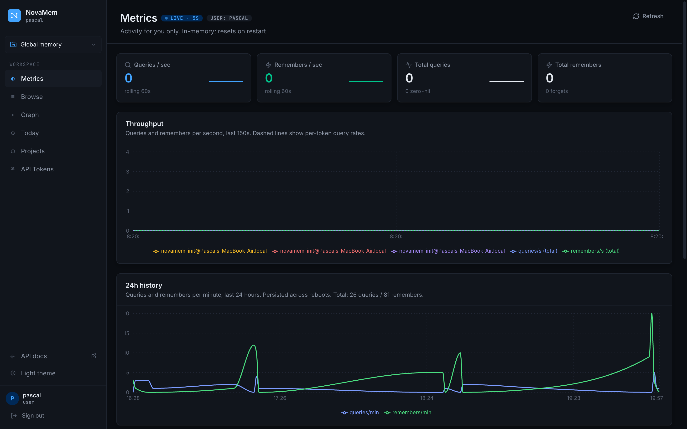

# novamem

**One memory across every AI agent you use.** Hybrid keyword + vector + graph + recency + entity retrieval (5-signal engine, graph/entity defaulted to 0 in production calibration). Per-user isolation with shareable sub-brains. Self-hostable on a laptop or as a multi-tenant brain for a whole company. Integrates with 30+ AI agent hosts.

### → [**azrtydxb.github.io/novamem**](https://azrtydxb.github.io/novamem/)

Full documentation, install paths, MCP host setup, architecture diagrams, API spec, and security model live on the project page above.

 

---

## License

Apache 2.0 — see [LICENSE](LICENSE) and [NOTICE](NOTICE).
