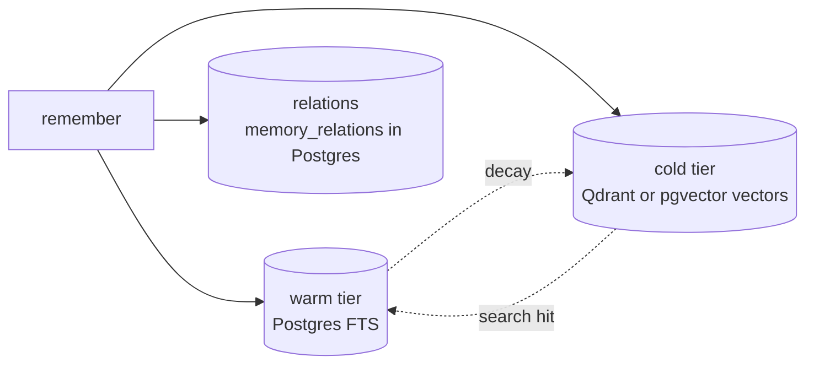

# Tiered storage

Three storage layers, three roles. Every memory entry lives in some combination of them: search reads warm + cold in parallel, and `/v1/neighbors` walks the relations layer.



## Warm — Postgres full-text search

**Job**: low-latency literal recall over active entries.

- Storage: `memory_entries` table with a `tsvector` shadow column maintained by a trigger on `content`.
- Query path: `SELECT … WHERE tsv @@ plainto_tsquery($1)` ranked by `ts_rank_cd`.
- Lifespan: an entry stays warm as long as `(now - last_hit) < effectiveDays(hits)`. The synaptic-decay sweep (every 6 h by default) demotes anything past that threshold.

## Cold — Qdrant vectors (or pgvector)

**Job**: semantic recall over older / less-frequently-touched entries.

By default, cold vectors live in Qdrant collections. Set `NOVAMEM_COLD_PROVIDER=pgvector` to use a partitioned Postgres table (`memory_vectors`) instead — useful when you want to avoid an extra service. pgvector uses HNSW indexes with `hnsw.iterative_scan = relaxed_order` for per-tenant filter recall.

- **Qdrant storage**: one collection per `(scope × namespace)` pair. Naming: `novamem_u_<userId>_<namespace>` for user-global entries and `novamem_p_<projectId>_<namespace>` for project entries. Older unprefixed `novamem_<userId>_<namespace>` collections are read as a compatibility fallback only.
- **pgvector storage**: single partitioned table with HNSW indexes per partition.
- Vector dim: `NOVAMEM_COLD_VECTOR_SIZE` (default 384, matching the local `all-MiniLM-L6-v2` embedder). Must match `NOVAMEM_EMBEDDINGS_DIM`.
- Reactive promotion: a cold entry whose accumulated lifespan now exceeds its idle time is moved back to warm on the same call that hit it. Without this, useful entries would slowly disappear forever.

## Relations — Postgres

Co-occurrence edges between memories live in the `memory_relations`
table (bitemporal `valid_from`/`valid_to`), written asynchronously after
each memory (durable `graph_pending_at` marker + reconciler) and
traversed by `/v1/neighbors` with a recursive CTE (undirected, depth
1–3, score = MAX over paths of the product of edge strengths). The
dedicated graph-database service was removed in Phase 7 of the
Mem0-alignment plan: its single-threaded writes were the ingest
bottleneck (179 ms mean per query), and the read tier it powered
measured zero contribution in the winning search calibration.

## Why three?

Each layer alone has a failure mode:

| Layer          | Strength                          | Weakness                                                      |
| -------------- | --------------------------------- | ------------------------------------------------------------- |
| Warm only      | Exact ids, function names, hashes | Misses paraphrases ("I want to eat" vs "I'm hungry")          |
| Cold only      | Semantic similarity               | Misses literals; a single typo'd identifier can fail to match |
| Relations only | Adjacent context                  | No initial seed; needs an entry to walk from                  |

Hybrid search fuses the keyword, vector, graph, recency, and entity signals, normalises (min-max) to a 0..1 scale, then weighted-sums with production defaults `keyword: 0.15, vector: 0.65, graph: 0, recency: 0, entity: 0`. The winning calibration ran graph and entity at 0 (Phase 7 removal); recency contributes via the separate rank prior bounded to [0.7, 1.15], which is why it sits at 0 in the signal weights. Override per call when you have a specific reason — `{keyword:1, vector:0}` for exact-id lookups, `{vector:1}` for pure semantic. Adjacency is served separately by `/v1/neighbors` over `memory_relations`.

## Decay maths

```
effectiveDays = NOVAMEM_DECAY_DAYS · log₂(hits + 1)
```

A fresh entry (1 hit) lives `7 days`. After 7 hits it lives `7 · log₂(8) = 21 days`. After 31 hits, 35 days. The shape is sub-linear — popular entries persist longer but you don't need millions of hits to keep something around.

## See also

- [Hybrid search internals](./hybrid-search.md)
- [Decay & dream cycle](./decay.md)
- [System shape](./system.md) — how tiers fit together with the engine layer
