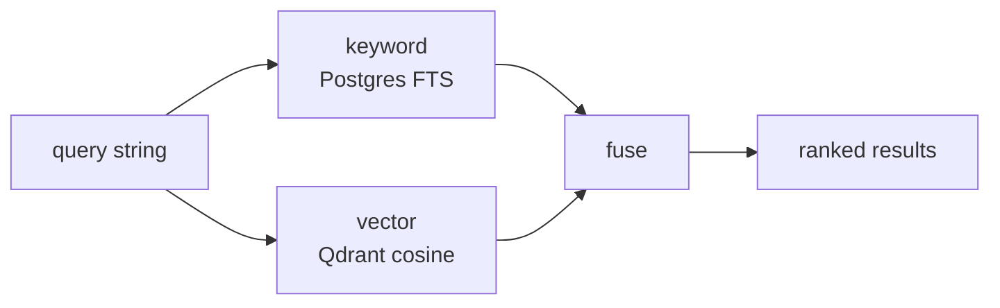

# Hybrid search internals

`memory_search` runs two queries in parallel and fuses the results into one ranked list. This page is the algorithmic detail.

## Two queries



Each branch returns a list of `{id, score}` pairs. Branches don't know about each other.

## Per-tier scoring

| Tier | Score source | Range |
|---|---|---|
| **Keyword** | `ts_rank_cd(tsv, websearch_to_tsquery($1))` per row | 0 — unbounded; ts_rank decreases with document length |
| **Vector** | Qdrant cosine similarity | -1 — 1, but novamem clamps to 0 — 1 |

## Keyword matching: strict, then loose

The keyword tier builds its query with `websearch_to_tsquery`, which ANDs the lexemes (and additionally understands quoted phrases and `OR` / `-` operators, so power users get search syntax for free). If that strict query matches nothing, the tier retries with the same parsed query rewritten to OR its terms.

That fallback matters because of how this tier is actually driven: `memory_context` passes the **entire user message** as the query. Under pure AND semantics a stored fact like *"NovaMem runs on port 7778"* could never match *"what port does the novamem deployment run on in production"* — every one of those lexemes had to appear in one row. The tier returned nothing on the primary grounding path, and hybrid search silently degraded to vector-only.

## Score scales

The two signals are *not* the same kind of number, so they are not treated the same way:

- **Vector** is a cosine similarity. It already has an absolute, model-independent meaning, so it is used raw (clamped to `[0, 1]`). It is deliberately **not** normalised per query. Rescaling the best hit to `1.0` — which novamem used to do — destroyed exactly that meaning: a query with nothing relevant in the store still produced a top result with a high score, because "best of a bad set" and "genuinely good" became indistinguishable.
- **Keyword** is `ts_rank`, which has no absolute scale at all — its magnitude depends on document length and corpus term frequency. It is therefore max-normalised within the query, the only defensible reading of it.

## Where the graph and entity tiers went

Earlier versions ran two additional search-time tiers — a neighbour walk over co-occurrence edges and entity bridging over extracted identifiers. Both were removed in Phase 7 of the Mem0-alignment plan: the winning search calibration ran their weights at 0 (the neighbour walk was derived from vector similarity, so it largely re-found what the vector tier already returned), and the dedicated graph service's single-threaded writes were the ingest bottleneck (measured 179 ms mean per query).

`weights.graph` and `weights.entity` are still accepted on the wire for compatibility, but contribute nothing. Adjacency itself is not gone — co-occurrence edges now live in the `memory_relations` Postgres table and are traversed on demand by [`/v1/neighbors`](/concepts/mental-model#graph-traversal-memory_neighbors), which is the right tool when you have a seed entry and want its surroundings.

## Weighted fuse

Default weights: `keyword: 0.3, vector: 0.6`. Tuned for prose; the user can override per call.

```
final(id) = w_k · norm_k(id) + w_v · vec(id)
```

Weights are renormalised across the tiers that actually returned candidates. Without that, a query where the keyword tier found nothing would cap every result at the vector weight, and an absolute score threshold would quietly mean something different depending on which tiers happened to be alive.

If a result is in only one tier, the missing tiers contribute 0. Because the vector signal keeps its absolute scale, **a top score below ~0.4 genuinely means "nothing relevant"** — the heuristic the agent instructions rely on.

## Noise floor

Cosine search always returns a nearest neighbour, even when nothing in the store is related. A candidate proposed *only* by the vector tier, below an absolute cosine floor (`NOVAMEM_SEARCH_MIN_VECTOR_SCORE`, default `0.25`), is dropped rather than surfaced with a confident-looking fused score. Candidates corroborated by a keyword signal are exempt — an exact identifier match at low cosine is still a real hit.

## Rank prior and diversification

After fusion, two adjustments run before the final top-K cut:

- **Rank prior** — the fused score is scaled by a gentle multiplicative prior built from `confidence` and, for memory types whose whole point is being current (`deployment_state`, `setup_fact`), how stale the entry is. Bounded to `[0.7, 1.15]`, so it re-orders near-ties without overturning a clear similarity win. Without it, a six-month-old deployment fact outranked last week's correction whenever its phrasing sat closer to the query.
- **Diversification** — results that restate a fact already selected (token overlap ≥ 0.75) are dropped, so a top-5 isn't three phrasings of the same thing. If this starves the result set, it backfills rather than under-returning.

Candidates are over-fetched (3× `k`) *before* superseded and sensitivity-hidden entries are filtered out, so `k` is `k` visible results. Filtering after the cut used to shrink a top-10 containing four superseded rows down to six.

## Why these defaults?

- Vector dominates because most natural-language queries ("how did we end up choosing X") are paraphrastic.
- Keyword is non-zero so identifiers / hashes / function names still rank.

Override patterns:

| Goal | Weights |
|---|---|
| Exact-id lookup | `{ keyword: 1, vector: 0 }` |
| Pure semantic | `{ vector: 1, keyword: 0 }` |

For neighbour-driven roaming around a known entry, use `memory_neighbors` instead of a weight override.

## Namespace fanout

When the request specifies neither `namespace` nor `includeNamespaces`, the engine fans out across **every namespace the caller has visible entries in** (per project scope). Falls back to `["default"]` if nothing's been written yet. This was the v1.1.4 fix — the old behaviour silently defaulted to `"default"` and missed every entry written elsewhere.

## Per-tier degradation

A flaky tier degrades the search instead of failing it. Each per-tier promise has a `.catch` — if Qdrant blips, the call returns whatever the warm tier found, with `degraded: true` on the response. Only Postgres being down is fatal.

## Hit accounting

After fusion, `metrics.recordQuery(tenantId, { warm, cold, graph })` counts how many of the returned ids came from each tier. Drives the "Hits per tier" chart on the dashboard. The `graph` counter is kept for wire compatibility and stays at 0.

## Source of truth

[`packages/server/src/engine/hybrid-search.ts`](https://github.com/azrtydxb/novamem/blob/main/packages/server/src/engine/hybrid-search.ts) is the small (≤200 line) file that implements the fuse — start there if you want to change the algorithm. The engine method `search()` orchestrates the per-tier calls.
