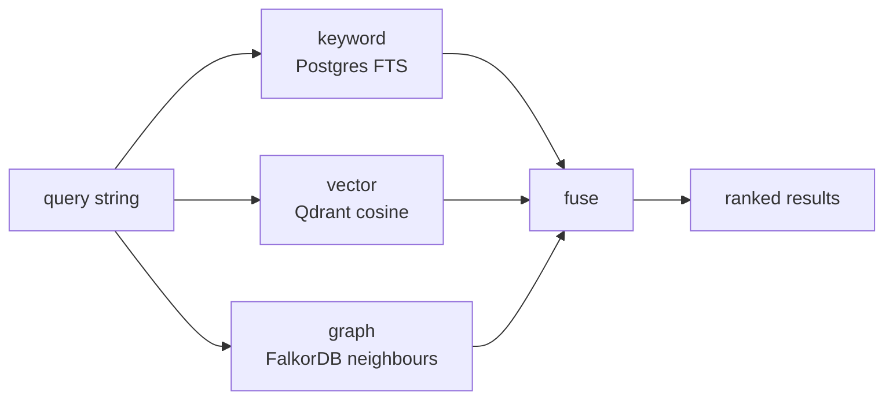

# Hybrid search internals

`memory_search` runs three queries in parallel and fuses the results into one ranked list. This page is the algorithmic detail.

## Three queries



Each branch returns a list of `{id, score}` pairs. Branches don't know about each other.

## Per-tier scoring

| Tier | Score source | Range |
|---|---|---|
| **Keyword** | `ts_rank_cd(tsv, plainto_tsquery($1))` per row | 0 — unbounded; ts_rank decreases with document length |
| **Vector** | Qdrant cosine similarity | -1 — 1, but novamem clamps to 0 — 1 |
| **Graph** | Edge strength averaged along the walk (`MAX(reduce(s = 1.0, e IN rels | s * e.strength))`) | 0 — 1 |

## Min-max normalisation

Raw scores are not comparable across tiers (a `ts_rank` of 0.4 means nothing relative to a cosine of 0.4). Before fusion each tier's scores are min-max'd into `[0, 1]`:

```
normalised(s) = (s - min) / (max - min)
```

The min and max are computed within the per-tier result list. So the strongest hit in any tier becomes 1.0; the weakest, 0.0.

## Weighted fuse

Default weights: `keyword: 0.3, vector: 0.6, graph: 0.1`. Tuned for prose; the user can override per call.

```
final(id) = w_k · norm_k(id) + w_v · norm_v(id) + w_g · norm_g(id)
```

If a result is in only one tier, the missing tiers contribute 0. Top-K is then sorted by `final` and returned.

## Why these defaults?

- Vector dominates because most natural-language queries ("how did we end up choosing X") are paraphrastic.
- Keyword is non-zero so identifiers / hashes / function names still rank.
- Graph is small but non-zero — a tie between two cold-tier hits is broken by which one has more strongly-linked neighbours, surfacing the "central" memory in a cluster.

Override patterns:

| Goal | Weights |
|---|---|
| Exact-id lookup | `{ keyword: 1, vector: 0, graph: 0 }` |
| Pure semantic | `{ vector: 1, keyword: 0, graph: 0 }` |
| Conceptual roaming | `{ vector: 0.5, graph: 0.5, keyword: 0 }` |

## Namespace fanout

When the request specifies neither `namespace` nor `includeNamespaces`, the engine fans out across **every namespace the caller has visible entries in** (per project scope). Falls back to `["default"]` if nothing's been written yet. This was the v1.1.4 fix — the old behaviour silently defaulted to `"default"` and missed every entry written elsewhere.

## Per-tier degradation

A flaky tier degrades the search instead of failing it. Each per-tier promise has a `.catch` — if Qdrant blips, the call returns whatever warm + graph found, with `degraded: true` on the response. Same for FalkorDB. Only Postgres being down is fatal.

## Hit accounting

After fusion, `metrics.recordQuery(tenantId, { warm, cold, graph })` counts how many of the returned ids came from each tier. Drives the "Hits per tier" chart on the dashboard.

## Source of truth

[`packages/server/src/engine/hybrid-search.ts`](https://github.com/azrtydxb/novamem/blob/main/packages/server/src/engine/hybrid-search.ts) is the small (≤200 line) file that implements the fuse — start there if you want to change the algorithm. The engine method `search()` orchestrates the per-tier calls.
