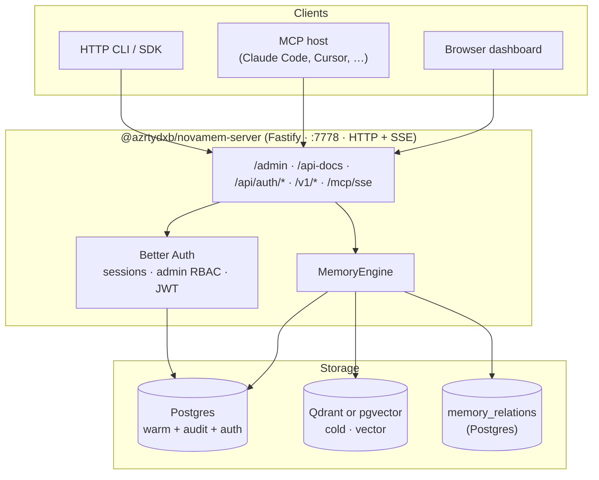
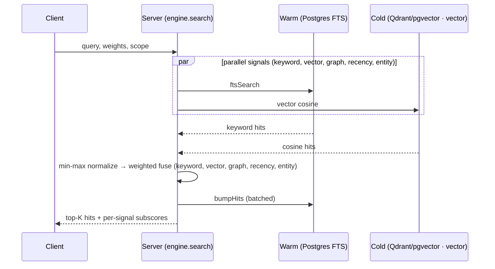
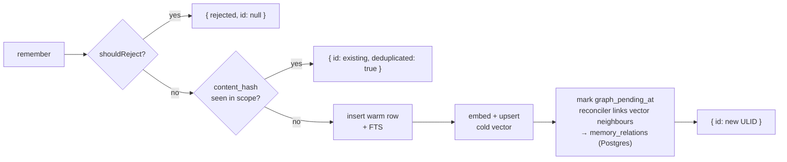
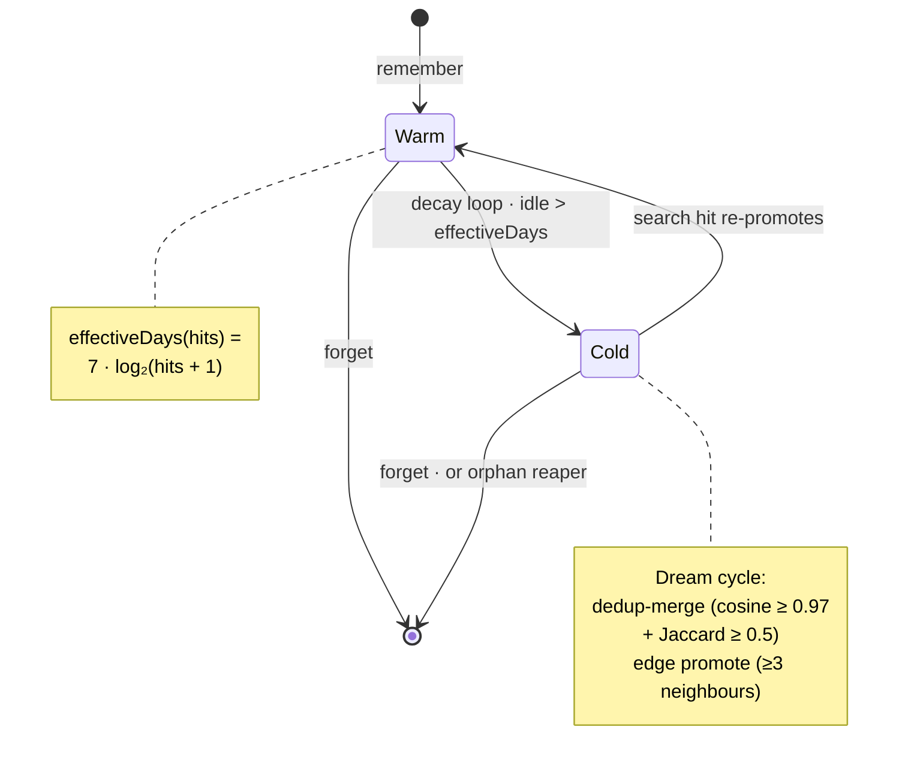

# novamem architecture

A 10-minute tour for new contributors.

## System shape

### Read path (memory_search)

### Write path (memory_remember)

### Tier lifecycle (decay + dream cycle)

## Data tiering

A memory entry exists on the **warm** tier (Postgres, fully addressable, FTS-indexed) until the decay loop demotes it to the **cold** tier (Qdrant, vector-only). Hybrid search runs three tiers (warm FTS keyword, cold cosine vector, graph neighbours, recency rank prior, entity bridge) in parallel and fuses with `min-max-normalised weighted scoring`. The winning calibration runs graph and entity weights at 0; recency contributes via the rank prior bounded to [0.7, 1.15]. Adjacency queries are served separately by `/v1/neighbors` over `memory_relations`.

- **Decay** — `effectiveDays(hits) = 7 × log₂(hits + 1)`. An entry idle for longer than its lifespan gets demoted. The decay loop runs every 6h by default; one bulk SQL UPDATE per loop tick.
- **Promotion** — reactive: a search that hits a cold entry whose accumulated lifespan now exceeds the pre-hit idle gap re-promotes it to warm.
- **Auto-linking** — every `remember()` marks the entry with a durable `graph_pending_at`; a reconciler drains the marker asynchronously, finding the top vector neighbours (`NOVAMEM_GRAPH_LINK_FANOUT`, `0` disables) and writing co-occurrence rows to `memory_relations`. Populates `/v1/neighbors` organically without blocking the write path.
- **Worthiness gate** — `engine.shouldReject` runs before every insert: rejects content < 12 chars or matching the conversational-filler regex; sha256-of-content fast-path returns the existing id when an exact duplicate already lives in the same `(user, project)`. Bypassed by `force: true`.
- **Dream cycle** — daily compaction pass. Walks every entry, queries qdrant for top-3 neighbours, merges duplicates at cosine ≥ 0.97 + token Jaccard ≥ 0.5; promotes A→B edges in `memory_relations` when the pair shares ≥3 neighbours (`relation: co_inferred`). Manual trigger at `POST /v1/dream-cycle`.

## Ownership model

A memory entry belongs to **exactly one user** (`memory_entries.user_id`). The user is the only first-class memory owner — there is no separate organization / tenant concept. A user can additionally create **projects** (sub-brains) which group memory and can be shared with other users.

Two stacked rules:

1. **User** is the global isolation unit. Every entry has a `user_id`; user-wide entries (`project_id IS NULL`) are scoped by `user_id` on every query.
2. **Project** is the sub-brain. When `project_id` is set, **project IS the access boundary** — `user_id` is decorative because projects can have members from different users (cross-user sharing).

Enforced in three places:

- **Warm store** — `getEntry`, `ftsSearch`, `engine.recent`, `engine.forget`. Project-scoped queries filter on `project_id` ALONE; user-scoped queries filter on `user_id` AND `project_id IS NULL`.
- **Cold store** — separate qdrant collections per scope:
  - User-wide: `novamem_u_<userId>_<namespace>` (the older unprefixed `novamem_<userId>_<namespace>` form is kept only as a read fallback for collections that pre-date the rename)
  - Project: `novamem_p_<projectId>_<namespace>`
  - The `u_` / `p_` prefixes guarantee user and project namespaces can't collide.
- **Relations** — `memory_relations` edges join `memory_entries` rows, so the `/v1/neighbors` recursive CTE inherits the warm store's user / project scoping on every hop.

### Active project

`user_active_project` (one row per user) holds an optional pointer at the user's current sub-brain. When set, memory_* calls without an explicit `project` arg default to it: search/recent/neighbors union user-global with the active project; remember/forget/update target the active project directly. Cleared by deleting the row (`DELETE /v1/me/active-project`, `project_deactivate` over MCP).

## AuthN / AuthZ

Two coexisting credential types resolve to the same `req.dashUser` shape:

- **Better Auth sessions** — email + password sign-in flow. Session token stored server-side in `"session"`; HttpOnly + SameSite=Lax cookie on the browser; same token also accepted as `Authorization: Bearer <session>` for non-browser dashboard callers. JWTs are issued on demand via `/api/auth/token` (15-min TTL) with JWKS at `/api/auth/jwks`.
- **`nm_…` user bearers** — minted via the dashboard `/v1/me/tokens` page. One bearer per device or agent. Stored as sha256 hashes in `user_tokens`; the plaintext is shown once at create time and is unrecoverable. A bearer carries every right the owning user has — global plus every project the user is a member of (no per-token scope).

The auth hook in `http.ts` runs on every request: it asks Better Auth for a session via `auth.api.getSession({ headers })`. If that hits, `req.dashUser` is populated. If not, and the route is `/v1/auth/*` or `/v1/me/*` and an `nm_…` bearer is present, it resolves the bearer to its underlying user and synthesises a `dashUser` from Better Auth's `"user"` row. Data-plane routes (`/v1/search`, `/v1/remember`, …) accept either path; admin routes additionally require `role: admin`.

A passthrough handler at `/api/auth/*` forwards only an **explicit allowlist** of Better Auth endpoints novamem uses (sign-in, sign-out, get-session, token/JWKS, password/session helpers, and audited admin-plugin endpoints). Public sign-up is intentionally not routed. Anything outside the allowlist returns 404. A pre-handler still intercepts `/api/auth/admin/remove-user` and `/api/auth/admin/set-role` to refuse operations that would leave zero admins.

## Provenance

Every memory entry carries:

- `source` — free-text label for the call origin (`manual`, `agent`, …)
- `source_type` — open-string vocabulary: `chat / email / code-review / doc / inference / observation / system / manual`
- `captured_from` — operator-defined identifier (agent name, conversation id, IP, …)
- `confidence` — 0..1, default 1.0; usable as a search filter
- `content_hash` — sha256 of trimmed content; powers the dedup fast-path

## Storage layout

### Postgres (warm)

| Table | Owner | Rows |
|---|---|---|
| `"user"` | Better Auth | dashboard users (email + password hash in `account`) |
| `"session"` | Better Auth | active sessions (revocable; 7-day rolling TTL) |
| `"account"` | Better Auth | per-provider credential rows (email/password by default) |
| `"verification"` | Better Auth | email verification tokens, when enabled |
| `"jwks"` | Better Auth | rotating JWT signing keys |
| `user_tokens` | novamem | sha256 hashes of per-device `nm_…` bearers |
| `user_active_project` | novamem | per-user "current sub-brain" pointer |
| `projects` | novamem | sub-brain identity + owner_user_id |
| `project_members` | novamem | (project, user, role) |
| `memory_entries` | novamem | content + user_id + optional project_id + provenance |
| `memory_access` | novamem | hits + lastAccessed (per entry) |
| `memory_fts` | novamem | tsvector shadow table |
| `memory_relations` | novamem | co-occurrence edges (bitemporal `valid_from`/`valid_to`); authoritative source for `/v1/neighbors` |
| `cold_orphans` | novamem | failed cold-deletes; reaper retries |
| `decay_runs` | novamem | per-loop summary |
| `admin_audit_log` | novamem | every admin action |
| `metrics_samples` | novamem | 1-minute persistent throughput buckets (24h history) |

The synthetic id `"public"` exists as the implicit owner for `auth.mode=none|bearer` deployments. Better Auth's tables coexist with novamem's; project / user_token tables don't FK to `"user"` directly because Better Auth manages user deletion on its own table — orphaned rows fail-safe at resolve time.

### Drizzle vs raw SQL boundary

The warm store internals are fully on drizzle (query-builder for the
mechanical CRUD, `db.execute(sql\`…\`)` for Postgres-specific bits like
FTS, `EXTRACT(EPOCH …)`, and the GENERATED `tsv` column). Drizzle owns
the schema; that's where the migrations live; that's the table-shape
source of truth.

The engine layer (`packages/server/src/engine/index.ts`) deliberately
uses raw `warm.pool.query` for its ~10 cross-cutting queries (decay
loop, orphan reaper, dream-cycle compaction, edge promotion, the
transactional `forget`). Reason: tests run against a `FakeWarmStore`
that mocks `warm.pool.query` by parsing the SQL string and serving
in-memory results — they don't fake drizzle's query builder. Keeping
the engine on raw SQL is what lets the test fakes stay simple. The
boundary is intentional: warm-store is "drizzle-managed schema",
engine is "business logic with direct SQL access for tests".

### Schema management

Schema is managed by **drizzle-kit migrations** (`packages/server/src/warm-store/migrations/`). On every boot, `WarmStore.initialize()` runs:

1. Idempotent legacy cleanups (`DROP CONSTRAINT IF EXISTS`, `DROP TABLE IF EXISTS`) for pre-Better-Auth artefacts on existing databases.
2. Better Auth + Postgres-FTS scaffolding (Better Auth's tables and the `tsv tsvector GENERATED ALWAYS AS (...)` column on `memory_fts` — drizzle's schema DSL doesn't model GENERATED columns).
3. `migrate()` from `drizzle-orm/node-postgres/migrator` over the 12 owned tables, tracked in the standard `__drizzle_migrations` history table.
4. Post-migration FTS GIN index.

The first migration (`0000_*.sql`) uses `CREATE … IF NOT EXISTS` so it's a no-op against the existing prod database; subsequent migrations are plain. See `CONTRIBUTING.md` for the schema-change workflow (run `pnpm db:generate`, review the diff, commit schema + migration together; CI's `pnpm db:check` enforces lockstep). Data migrations and column renames still need hand-editing the generated SQL — drizzle-kit's diff isn't always right for those.

### Qdrant (cold)

One collection per (scope, namespace) pair. Collection names embed the scope id, so cross-scope queries are structurally impossible.

### Relations (`memory_relations` in Postgres)

Co-occurrence edges live in the bitemporal `memory_relations` table (`valid_from`/`valid_to`), written asynchronously after each memory behind a durable `graph_pending_at` marker drained by a reconciler. Edge `relation` is `co_occurs` for vector-neighbour auto-links and `co_inferred` for dream-cycle edge promotion. `/v1/neighbors` (and the `memory_neighbors` MCP tool) traverses them with a recursive CTE — undirected, depth 1–3, score = MAX over paths of the product of edge strengths. For wire compatibility, `/health` reports `deps.graph` as `"disabled"` permanently.

## Transports

- **HTTP/JSON** — Fastify 5. Bodies validated with Zod. OpenAPI 3.0 is generated from the live Fastify route tree and route schemas via `@fastify/swagger`, served raw at `/openapi.json`, and rendered by `@fastify/swagger-ui` at `/api-docs`.
- **MCP SSE (recommended)** — `GET /mcp/sse` opens an event stream; `POST /mcp/messages?sessionId=…` sends JSON-RPC. User identity is captured at handshake from the auth hook. Direct-SSE clients connect without a shim.
- **MCP stdio (legacy shim)** — `packages/mcp/src/index.ts` is a thin stdio↔HTTP bridge for clients that don't speak remote MCP yet. The shim talks to the same `/v1/*` and `/api/auth/*` endpoints any other client uses.

## Dashboard

`packages/admin-ui` — React 19 + Vite + Tailwind 4. Built and copied into `packages/server/dist/admin/ui/` by the server build; served by `@fastify/static` under `/admin/`. CSP is strict (`default-src 'self'`); Inter + JetBrains Mono are bundled (no CDN).

Sign-in calls `POST /api/auth/sign-in/email`. Better Auth sets the HttpOnly session cookie; the SPA reads the user via `GET /api/auth/get-session` on every page load. Admin user CRUD is wired directly to `/api/auth/admin/{create-user,list-users,set-role,remove-user}`.

Admin sidebar: Metrics · Health · Users.
User sidebar: Metrics · Browse · Graph · Today · Projects · API Tokens.

### Design system (Grid direction)

Modern technical SaaS aesthetic (Linear / Vercel-grade polish). Fixed 224px sidebar, content area with 20px page padding.

**Colors** (CSS custom properties, light + dark modes):

Light: `--bg: #fafbfc` · `--panel: #ffffff` · `--subtle: #f3f5f8` · `--ink: #0d1117` · `--dim: #5b6470` · `--faint: #8b94a3` · `--rule: #e6e9ee` · `--rule-soft: #eef0f4`

Dark: `--bg: #0a0d12` · `--panel: #11151c` · `--subtle: #161b24` · `--ink: #e6ebf2` · `--dim: #8a93a3` · `--faint: #5a6373` · `--rule: #1f2530` · `--rule-soft: #171c25`

**Brand tones** (oklch):
- `--accent` (primary action) — light `oklch(58% 0.15 250)` / dark `oklch(70% 0.16 250)`
- `--warm` (warm-tier signal) — light `oklch(62% 0.16 35)` / dark `oklch(72% 0.17 35)`
- `--cold` (cold-tier signal) — light `oklch(58% 0.13 220)` / dark `oklch(72% 0.14 220)`
- `--graph` (relations / ok status) — light `oklch(60% 0.16 165)` / dark `oklch(72% 0.16 165)`
- `--err` (error) — light `oklch(58% 0.20 25)` / dark `oklch(70% 0.20 25)`
- `--warn` (degraded) — light `oklch(70% 0.16 80)` / dark `oklch(78% 0.16 80)`

Each tone has a `*-soft` variant for backgrounds (light: 95% lightness / dark: 28% lightness).

**Typography:** `Inter` 400/500/600/700 (sans) + `JetBrains Mono` 400/500/600 (mono for ids, hashes, timestamps, chips, metric labels). Tabular numerals everywhere in tables/KPIs (`font-variant-numeric: tabular-nums`). Letter-spacing −0.02em on headings/big values.

**Spacing:** 4 · 6 · 8 · 10 · 12 · 14 · 18 · 20 · 24 · 28 · 32 px. Card padding: 14–18px.

**Radii:** 4 (chips) · 6 (buttons, inputs) · 8 (cards) · 12 (auth modal) · 99 (pills).

**Key patterns:**
- KPI card: label + delta pill + big value + sparkline
- DataTable: header strip on `subtle` bg + grid rows with soft rules
- Status pill: `font-weight 600 10px/1 mono`, `uppercase`, `padding 2px 8px`, `border-radius 99px`
- Tier color encoding: single `tone` prop drives pills, dots, fills, strokes everywhere

## Build + deploy

- pnpm workspaces. `pnpm -r build` builds in dependency order (client → mcp → admin-ui → server).
- The runtime Dockerfile drops privileges, ships only `dist/` + production deps, and declares `HEALTHCHECK`.
- Default port 7778 on both host + container.
- k3s manifests live under `deploy/k8s/` — single-replica StatefulSets for Postgres / Qdrant on local-path PVCs, plus a `ClusterIP` Service for novamem fronted by a TLS-terminating Ingress (`deploy/k8s/ingress.yaml`). The ConfigMap pins `NOVAMEM_BASE_URL` to the public Ingress origin so Better Auth's trusted-origin check accepts the SPA.

## Things that aren't here yet

- No OpenTelemetry exporter (Prometheus exposition is at `/v1/admin/metrics/prom`).
- Test fakes are SQL-substring shims — solid for engine logic but not for verifying SQL correctness; PGlite migration is a candidate.
- No social/OIDC providers (Google, GitHub, …) — Better Auth's hooks are configured for future use, not enabled.
- The OpenAPI spec is generated from the Fastify route tree and route Zod schemas via `@fastify/swagger`; `/openapi.json` should be smoke-checked after adding routes.

See [../CHANGELOG.md](../CHANGELOG.md) for behaviour shifts and [../SECURITY.md](../SECURITY.md) for the production hardening checklist.
