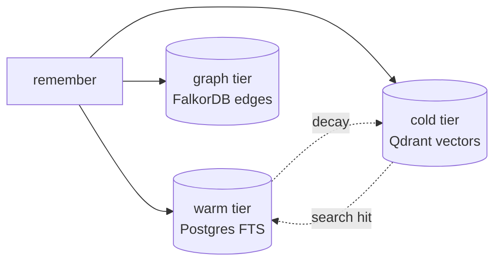

# Tiered storage

Three storage layers, three roles. Every memory entry lives in some combination of them, and search reads from all three in parallel.



## Warm — Postgres full-text search

**Job**: low-latency literal recall over active entries.

- Storage: `memory_entries` table with a `tsvector` shadow column maintained by a trigger on `content`.
- Query path: `SELECT … WHERE tsv @@ plainto_tsquery($1)` ranked by `ts_rank_cd`.
- Lifespan: an entry stays warm as long as `(now - last_hit) < effectiveDays(hits)`. The synaptic-decay sweep (every 6 h by default) demotes anything past that threshold.

## Cold — Qdrant vectors

**Job**: semantic recall over older / less-frequently-touched entries.

- Storage: one Qdrant collection per `(tenant × project × namespace)` triple. Naming: `novamem_<tenantId>_<namespace>` for tenant-wide, `novamem_p_<projectId>_<namespace>` for project entries.
- Vector dim: `NOVAMEM_COLD_VECTOR_SIZE` (default 384, matching the local `all-MiniLM-L6-v2` embedder). Must match `NOVAMEM_EMBEDDINGS_DIM`.
- Reactive promotion: a cold entry whose accumulated lifespan now exceeds its idle time is moved back to warm on the same call that hit it. Without this, useful entries would slowly disappear forever.

## Graph — FalkorDB

**Job**: surface adjacent context — "what was related to this hit that I forgot to ask about."

- Storage: `Memory {id, user, project}` nodes with `RELATES {kind, strength}` edges.
- Auto-link: every `remember()` calls `linkVectorNeighbors()` which connects the new node to its top-N vector neighbours (default `graphLinkFanout=3`). One round-trip via the batch `addEdgesBatch`.
- Traversal: depth 1 (hot path), 2, or 3 — controlled by an allowlist so cost is bounded. Cypher path-product aggregates strengths along multi-hop walks.
- Optional: `NOVAMEM_GRAPH_ENABLED=false` skips graph entirely; engine emits `degraded: true` on every search.

## Why three?

Each tier alone has a failure mode:

| Tier | Strength | Weakness |
|---|---|---|
| Warm only | Exact ids, function names, hashes | Misses paraphrases ("I want to eat" vs "I'm hungry") |
| Cold only | Semantic similarity | Misses literals; a single typo'd identifier can fail to match |
| Graph only | Adjacent context | No initial seed; needs an entry to walk from |

Hybrid fusion picks the strengths from each, normalises (min-max) to a 0..1 scale, then weighted-sums with defaults `keyword: 0.3, vector: 0.6, graph: 0.1`. Override per call when you have a specific reason — `{keyword:1, vector:0}` for exact-id lookups, `{vector:1}` for pure semantic.

## Decay maths

```
effectiveDays = NOVAMEM_DECAY_DAYS · log₂(hits + 1)
```

A fresh entry (1 hit) lives `7 days`. After 7 hits it lives `7 · log₂(8) = 21 days`. After 31 hits, 35 days. The shape is sub-linear — popular entries persist longer but you don't need millions of hits to keep something around.

## See also

- [Hybrid search internals](/architecture/hybrid-search)
- [Decay & dream cycle](/architecture/decay)
- [System shape](/architecture/system) — how tiers fit together with the engine layer
