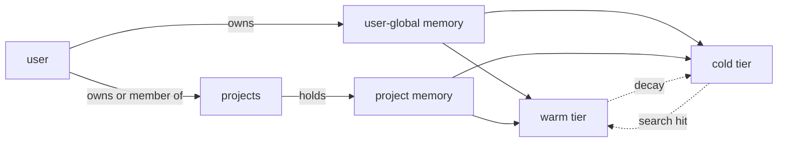

# Usage

What novamem does, when to use each tool, what the gates and decay loops mean for you. For the underlying mechanics see [architecture.md](architecture.md). For per-tool field reference see [skills/novamem/references/](../skills/novamem/references) or the [OpenAPI spec](api/README.md).

## Mental model

A novamem instance holds **memory entries**. Every entry belongs to a single user. An entry can additionally belong to a **project** (a sub-brain) which can be shared with other users. Each entry lives in a **tier** — warm or cold — and each search runs five signals (keyword, vector, graph, recency, entity) in parallel.



A user-global entry is invisible to anyone else, period. A project entry is visible to every member of that project — that's the whole point of sharing.

## Searching (`memory_search`)

Hybrid search runs **keyword (FTS)** + **vector (cosine)** + **graph (neighbour)** + **recency (rank prior)** + **entity (identifier bridge)** in parallel and fuses them with weighted scoring:

| Default weight | Signal  | Best for                                                         |
| -------------- | ------- | ---------------------------------------------------------------- |
| 0.65           | vector  | concept-level questions, paraphrases                             |
| 0.15           | keyword | literal symbol / id / file / hash matches                        |
| 0.10           | recency | recently accessed entries (exponential decay prior)              |
| 0.05           | graph   | adjacency via co-occurrence edges (defaulted to 0 in production) |
| 0.05           | entity  | exact identifier bridging (defaulted to 0 in production)         |

Override weights when a default doesn't fit the question:

| Need                                                  | `weights`                                                   |
| ----------------------------------------------------- | ----------------------------------------------------------- |
| Exact id / file path / commit hash                    | `{ keyword: 1, vector: 0 }`                                 |
| Pure semantic ("things like X" with no shared tokens) | `{ vector: 1, keyword: 0 }`                                 |
| Neighbour-driven recall around a known entry          | use [`memory_neighbors`](#graph-traversal-memory_neighbors) |

Hits below \~0.4 are misses — treat them as "nothing relevant" rather than chasing low-confidence matches.

### Cross-namespace and cross-project search

By default a search runs in one `namespace` (default `"default"`) and one `project` (or user-global if no `project` arg). Two ways to widen:

- `includeNamespaces: ["a", "b"]` — union across namespaces (capped at 16)
- `includeProjects: ["a", "b"]` — union user-global with each listed project (capped at 16)

Or set an [active project](#active-project-sub-brains) once and `memory_*` defaults to it.

## Capturing (`memory_capture`)

`memory_capture` is the preferred agent-facing write path after meaningful work. It applies the worthiness gate and exact-duplicate SHA fast-path, then checks nearby active memories before inserting:

- **Near-duplicate / refinement** — update the existing entry in place and return `{ id, deduplicated: true, updated: true }`.
- **Contradiction / supersession** — insert the new entry, mark older contradictory entries as `metadata.lifecycleStatus = "superseded"`, and return `{ id, superseded: [<oldId>, ...] }`.
- **Fresh fact** — insert normally.

Superseded/deprecated entries are hidden from normal search/context results so agents see the current fact.

## Remembering (`memory_remember`)

Save things that will still matter next session:

- **Decisions with reasoning** — "chose drizzle over knex because we want compile-time-checked SQL"
- **User preferences** that recur — tools, formatting, review style
- **Hidden constraints** — legal, deadlines, dep pins
- **Bug post-mortems** — root cause + fix, not just the fix
- **Architecture invariants** the codebase wouldn't reveal on its own

**Don't** save:

- Conversational context that ends with the task
- Facts trivially derivable from the current code
- Anything the user said is private/secret
- Verbatim error stack traces — extract the diagnosis instead

### The worthiness gate

Every `remember` call passes through a hard-rule gate before insertion:

- **Length floor** — trim then reject if < 12 chars
- **Filler regex** — single-word canned replies (`thanks?`, `ok(ay)?`, `sure`, `got it`, `noted`, …)

A rejected request returns `{ id: null, rejected: <reason> }` with HTTP 200 — no error, just a signal. Pass `force: true` to bypass when the user explicitly asked.

### The exact-duplicate fast-path

Every entry stores a sha256 of its normalised content. If you `remember` something already present in the same `(user, project, namespace)` scope, the response is `{ id: <existingId>, deduplicated: true }` — the existing row's hit count is bumped and its decay clock is refreshed. **Treat this as success.**

This runs even when `force: true`, so a duplicate of yourself just returns the existing id.

### Provenance

Set these on `remember` (and `update`) when known:

| Field          | Vocabulary                                                                                   | Purpose                                             |
| -------------- | -------------------------------------------------------------------------------------------- | --------------------------------------------------- |
| `sourceType`   | `chat` / `email` / `code-review` / `doc` / `inference` / `observation` / `system` / `manual` | filter by where the fact came from                  |
| `capturedFrom` | free text                                                                                    | agent name, conversation id, channel ref            |
| `confidence`   | `0..1`, default `1.0`                                                                        | lower for inferred facts; usable as a future filter |

## Updating (`memory_update`)

Facts evolve. When the user says "I now live in Singapore", search for the existing "lives in" memory and call `memory_update` instead of `forget` + `remember`. Update preserves the entry's id, hit count, and relation edges; it re-embeds when `content` changes. Skip the embedder by omitting `content` if you only need to bump metadata, provenance, or confidence.

## Forgetting (`memory_forget`)

Hard delete: removes warm row, FTS shadow, cold vector, and relation edges. There is no undo. Use when:

- The user explicitly asks to forget
- An entry is wrong and not just outdated (use `update` for outdated)
- You wrote a memory that the user vetoed in the same turn

## Time-windowed recall

`memory_recent` returns newest-first within a namespace, with an optional `since` ISO-8601 lower bound. `memory_today` is sugar for `recent` with `since = now - 24h`. Use these when the user is anchoring on **time**, not relevance ("what did we work on yesterday?").

Surfacing a cold entry via `recent` does **not** auto-promote it (only `search` does); recall is non-mutating.

## Graph traversal (`memory_neighbors`)

Walks the co-occurrence edges in the `memory_relations` table (a recursive CTE in Postgres — undirected, depth 1–3, score = MAX over paths of the product of edge strengths) from a seed entry id and returns the same hit shape as `search`. `depth` defaults to 1; **prefer 1**, larger depths are exponential and noisy.

Edges come from two sources:

- `co_occurs` — written asynchronously after each `remember`, linking the new entry to its top vector neighbours
- `co_inferred` — written by the dream cycle when two entries share ≥3 common neighbours

Edges are written behind a durable pending marker, so a neighbour query immediately after a `remember` may not see the newest edges yet — they arrive once the reconciler drains.

## Projects (sub-brains)

A project is a named collection of memories the owner can share with other users. Project memories are visible to every member; the owner can add or remove members at any time.

The seven `project_*` tools cover the full lifecycle:

| Tool                 | Who        | Purpose                                                                                  |
| -------------------- | ---------- | ---------------------------------------------------------------------------------------- |
| `project_list`       | any user   | list projects the caller owns or is a member of                                          |
| `project_create`     | any user   | create a new project; the caller becomes its owner. Returns the assigned ULID            |
| `project_delete`     | owner only | delete the project and **every** memory entry, vector, and relation edge in it. No undo  |
| `project_share`      | owner only | add another user as a member by their **exact email address**. Member can read and write |
| `project_unshare`    | owner only | remove a member. The owner cannot unshare themselves — `project_delete` instead          |
| `project_activate`   | any user   | set the caller's active project (server-side per-user state)                             |
| `project_deactivate` | any user   | clear the active project                                                                 |

### Active project

`project_activate({ project: <id-or-name> })` makes subsequent `memory_*` calls **without** an explicit `project` arg default to it:

- `search` / `recent` / `neighbors` union the active project with user-global
- `remember` / `forget` / `update` target the active project directly

Use this when the user signals they're working on a specific project ("let's switch to Phoenix"). The pointer is server-side state per user, so a switch on one device is visible to every other device the user signs in from.

## Stats (`memory_stats`)

Per-caller snapshot of how big the caller's memory is, scoped to the authenticated user. No arguments; non-mutating. Returns:

| Field                     | Shape                          | Meaning                                                         |
| ------------------------- | ------------------------------ | --------------------------------------------------------------- |
| `byNamespace`             | `Record<string, {warm, cold}>` | Entry counts grouped by namespace, split by tier                |
| `totalWarm` / `totalCold` | `number`                       | Caller's totals across all namespaces                           |
| `lastDecayAt`             | ISO-8601 or `null`             | When the service last ran the decay loop (service-wide context) |
| `uptimeMs`                | `number`                       | Service uptime in ms (service-wide context)                     |

Useful for skills that want to surface a "you have N entries across M namespaces" hint without polling the dashboard. **Not** the dashboard's full Metrics view — that's `/v1/me/metrics` (per-user counters + rolling rates) or `/v1/admin/metrics` (the whole service).

## Decay and reinforcement

Entries decay if not accessed:

```
effectiveDays(hits) = 7 · log₂(hits + 1)
```

An entry idle for longer than its lifespan gets demoted from warm → cold by the decay loop (every 6 h by default). A subsequent `search` that hits the cold entry re-promotes it to warm.

You don't need to manage this. Just know that frequently-relevant entries don't fall off, and once-and-done facts age out gracefully.

## Dream cycle (compaction)

A daily compaction pass — also triggerable on demand via `POST /v1/dream-cycle` — does two things:

1. **Dedup-merge** — for each entry, query Qdrant for top-3 vector neighbours; merge a pair when **cosine ≥ 0.97 AND token-set Jaccard ≥ 0.5**. Both required so contradictions like "lives in X" / "lives in Y" don't collapse. Picks canonical by hit count (oldest tiebreak), redirects relation edges, sums hits, deletes the loser everywhere.
2. **Edge promotion** — when two entries share ≥3 neighbours in common in `memory_relations`, add a direct A→B edge with `relation: "co_inferred"`. Tagged distinctly from `co_occurs` so ranking can dial it back.

Response: `{ walked, merged, edgesPromoted, durationMs }`.

## Per-host wiring

For agent-host integrations (when to remember, what weights to pick, project scoping conventions), see the [Connect](README.md#connect-an-ai-tool) guides — each one has the host-specific behaviour rules and a `verify` snippet.

## Errors and signals

| Response                                 | Meaning                                   | What to do                                                               |
| ---------------------------------------- | ----------------------------------------- | ------------------------------------------------------------------------ |
| `{ id: null, rejected: <reason> }`       | Worthiness gate                           | Surface the reason; retry with `force: true` only if the user asked      |
| `{ id: <existing>, deduplicated: true }` | Exact-duplicate fast-path                 | Success — the existing entry was reinforced                              |
| `degraded: true` on `search`             | A retrieval tier (usually Qdrant) errored | Mention to the user; the remaining tier's results still work             |
| `401`                                    | Bearer missing / revoked                  | Don't retry; surface to the user                                         |
| `403 not a member`                       | Project exists but caller can't reach it  | Distinct from `404`; the project name is right but you don't have access |
| `404 no such project`                    | Project name/id doesn't resolve           | Caller should `project_list` to see what's available                     |

## Context packs v2

`memory_context` returns `contextPack` grouped both by memory type and by scope. `userGlobal` contains memories that apply across projects; `projectScoped` contains memories tied to a specific sub-brain. Agents should prefer project-scoped operational facts when the user is inside a project, while still applying user-global preferences and safety constraints.
